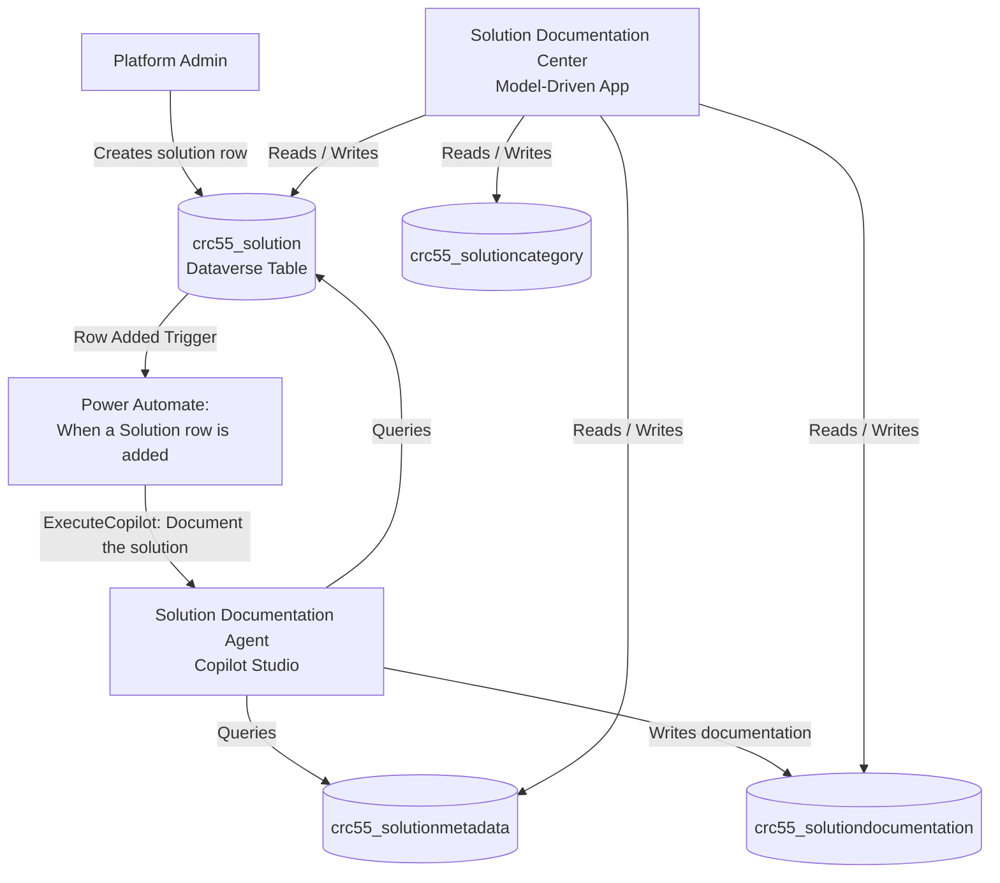

# Architecture Overview

## Document Metadata

| Field | Value |
|---|---|
| **Solution Name** | Solution Documentaion |
| **Document Type** | Architecture Overview |
| **Document Version** | 1.0 |
| **Generated On** | 2026-04-08 |

---

## Architectural Pattern

The solution follows an **event-driven AI documentation** pattern:

1. A platform administrator or solution owner creates a row in the `crc55_solution` Dataverse table.
2. A Power Automate cloud flow (Dataverse trigger) detects the new row.
3. The flow sends a natural-language prompt to the **Solution Documentation Agent** (Copilot Studio) via the Microsoft Copilot Studio connector.
4. The agent processes the prompt, queries Dataverse for solution metadata, and generates structured documentation.
5. The agent persists each generated document as a row in `crc55_solutiondocumentation`.
6. Users access and manage all documentation through the **Solution Documentation Center** model-driven app.

---

## Architecture Diagram

---

## Layer Descriptions

### Presentation Layer
- **Solution Documentation Center** (Model-Driven App, `crc55_SolutionDocumentatia6f844fa`)
  - Provides CRUD access to solutions, documentation, metadata, and categories.
  - Target users: Platform administrators, solution owners, architects.

### Orchestration Layer
- **Power Automate Cloud Flow** (`When a Solution row is added`)
  - Trigger: Dataverse row added on `crc55_solution` table, Organization scope.
  - Action: Calls `ExecuteCopilot` on agent `jenssch_solutiondocumentationagent`.
  - Message: `"Document the {solution name} solution"`.
  - Connection References used:
    - `shared_commondataserviceforapps` via `jenssch_AdverseMediaQueryAgent.shared_commondataserviceforapps.d883130156a64d53a16b6134d7f25316`
    - `shared_microsoftcopilotstudio` via `jenssch_sharedmicrosoftcopilotstudio_6d463`

### Intelligence Layer
- **Solution Documentation Agent** (Copilot Studio Bot, ID: `0c5b2c9c-fc24-f111-88b3-7ced8d3c72c7`)
  - Receives a prompt containing the solution name.
  - Contains multiple bot components (topics/nodes) handling the documentation generation logic.
  - Writes output to `crc55_solutiondocumentation`.

### Data Layer
- **Dataverse** tables with `crc55_` prefix store all persistent state.
- See the **Data Model & Relationships** document for full table definitions.

---

## Technology Stack

| Technology | Role |
|---|---|
| Microsoft Dataverse | Data persistence and event source |
| Power Automate | Event-driven orchestration |
| Copilot Studio | AI documentation agent |
| Model-Driven App | End-user interface |
| Microsoft Copilot Studio Connector | Agent invocation from Power Automate |
| Dataverse Connector (shared_commondataserviceforapps) | Dataverse access from flow |
