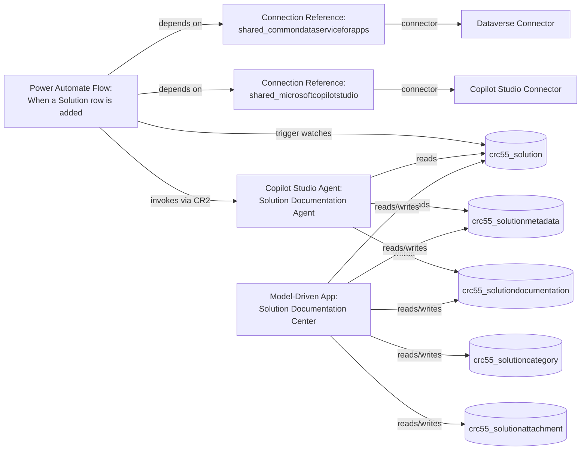

# Component Dependencies

## Document Metadata

| Field | Value |
|---|---|
| **Solution Name** | Solution Documentaion |
| **Document Type** | Component Dependencies |
| **Document Version** | 1.0 |
| **Generated On** | 2026-04-08 |

---

## Dependency Map

---

## Dependency Table

| Source Component | Depends On | Dependency Type | Notes |
|---|---|---|---|
| **Power Automate Flow** | `crc55_solution` (Dataverse Table) | Trigger – Row Added | Flow fires when new solution row is inserted |
| **Power Automate Flow** | Connection Reference: `shared_commondataserviceforapps` | Runtime connector binding | Required for Dataverse webhook subscription |
| **Power Automate Flow** | Connection Reference: `shared_microsoftcopilotstudio` | Runtime connector binding | Required to invoke the Copilot Studio agent |
| **Power Automate Flow** | Copilot Studio Agent (`jenssch_solutiondocumentationagent`) | Agent invocation target | Agent must be published and accessible |
| **Copilot Studio Agent** | `crc55_solution` | Data read | Agent reads solution details to generate docs |
| **Copilot Studio Agent** | `crc55_solutionmetadata` | Data read | Agent reads environment/version metadata |
| **Copilot Studio Agent** | `crc55_solutiondocumentation` | Data write | Agent persists generated documentation |
| **Model-Driven App** | `crc55_solution` | Read/Write | Core entity in the app |
| **Model-Driven App** | `crc55_solutiondocumentation` | Read/Write | Displays and edits documentation |
| **Model-Driven App** | `crc55_solutionmetadata` | Read/Write | Displays and edits metadata |
| **Model-Driven App** | `crc55_solutioncategory` | Read/Write | Category reference |
| **Model-Driven App** | `crc55_solutionattachment` | Read/Write | Attachment management |

---

## External / Shared Dependencies

| Dependency | Type | In Solution | Notes |
|---|---|---|---|
| Dataverse Connector (`shared_commondataserviceforapps`) | Platform connector | ❌ Shared / Platform | Must be connected at deployment time |
| Microsoft Copilot Studio Connector (`shared_microsoftcopilotstudio`) | Platform connector | ❌ Shared / Platform | Must be connected at deployment time |
| Copilot Studio Agent (`jenssch_solutiondocumentationagent`) | Bot | ✅ In Solution | Agent must be activated |

---

## Activation Order

When deploying this solution, components must be activated in this order:

1. Import and publish all Dataverse tables.
2. Publish the **Copilot Studio Agent** (`Solution Documentation Agent`).
3. Configure **Connection References**:
   - Bind `shared_commondataserviceforapps` to a valid Dataverse connection.
   - Bind `shared_microsoftcopilotstudio` to a valid Copilot Studio connection.
4. Turn on the **Power Automate Flow** (`When a Solution row is added`).
5. Publish the **Model-Driven App** (`Solution Documentation Center`).
