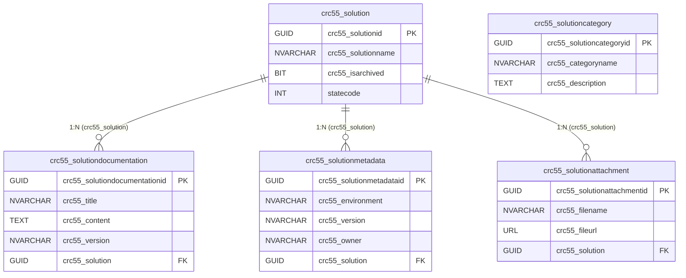

# Data Model & Relationships

## Document Metadata

| Field | Value |
|---|---|
| **Solution Name** | Solution Documentaion |
| **Document Type** | Data Model & Relationships |
| **Document Version** | 1.0 |
| **Generated On** | 2026-04-08 |

---

## Tables Overview

All custom tables use the publisher prefix `crc55_`.

| Table (Logical Name) | Display Name | Primary Key | Purpose |
|---|---|---|---|
| `crc55_solution` | Solution | `crc55_solutionid` | Root entity – stores registered Power Platform solutions |
| `crc55_solutiondocumentation` | Solution Documentation | `crc55_solutiondocumentationid` | Stores generated documentation articles per solution |
| `crc55_solutionmetadata` | Solution Metadata | `crc55_solutionmetadataid` | Stores environment and version metadata per solution |
| `crc55_solutioncategory` | Solution Category | `crc55_solutioncategoryid` | Lookup/reference table for solution categories |
| `crc55_solutionattachment` | Solution Attachment | `crc55_solutionattachmentid` | File attachments associated with a solution |

---

## Table: crc55_solution

| Column | Type | Required | Notes |
|---|---|---|---|
| `crc55_solutionid` | GUID | Yes | Primary key |
| `crc55_solutionname` | NVARCHAR(850) | Yes | Display name of the solution |
| `crc55_isarchived` | BIT | No | Soft-archive flag |
| `statecode` | STATE (INT) | Yes | 0 = Active, 1 = Inactive |
| `statuscode` | STATUS (INT) | Yes | 1 = Active, 2 = Inactive |
| `ownerid` | OWNER | Yes | Record owner |
| `createdon` | DATETIME | System | Auto-populated |
| `modifiedon` | DATETIME | System | Auto-populated |

---

## Table: crc55_solutiondocumentation

| Column | Type | Required | Notes |
|---|---|---|---|
| `crc55_solutiondocumentationid` | GUID | Yes | Primary key |
| `crc55_title` | NVARCHAR(850) | Yes | Document title |
| `crc55_content` | MULTILINE TEXT | No | Markdown content of the document |
| `crc55_version` | NVARCHAR(100) | No | Document version (e.g., "1.0") |
| `crc55_solution` | LOOKUP → crc55_solution | No | FK to parent solution |
| `statecode` | STATE (INT) | Yes | 0 = Active, 1 = Inactive |
| `ownerid` | OWNER | Yes | Record owner |

---

## Table: crc55_solutionmetadata

| Column | Type | Required | Notes |
|---|---|---|---|
| `crc55_solutionmetadataid` | GUID | Yes | Primary key |
| `crc55_environment` | NVARCHAR(850) | Yes | Target environment name |
| `crc55_version` | NVARCHAR(100) | No | Solution version string |
| `crc55_owner` | NVARCHAR(100) | No | Solution owner name |
| `crc55_solution` | LOOKUP → crc55_solution | No | FK to parent solution |
| `statecode` | STATE (INT) | Yes | 0 = Active, 1 = Inactive |
| `ownerid` | OWNER | Yes | Record owner |

---

## Table: crc55_solutioncategory

| Column | Type | Required | Notes |
|---|---|---|---|
| `crc55_solutioncategoryid` | GUID | Yes | Primary key |
| `crc55_categoryname` | NVARCHAR(850) | Yes | Category label |
| `crc55_description` | MULTILINE TEXT | No | Category description |
| `statecode` | STATE (INT) | Yes | 0 = Active, 1 = Inactive |

> **Note:** No direct FK column to `crc55_solution` was found. The relationship may be implemented through the model-driven app navigation or is not yet defined.

---

## Table: crc55_solutionattachment

| Column | Type | Required | Notes |
|---|---|---|---|
| `crc55_solutionattachmentid` | GUID | Yes | Primary key |
| `crc55_filename` | NVARCHAR(850) | Yes | Attachment file name |
| `crc55_fileurl` | URL (NVARCHAR(100)) | No | URL to the file |
| `crc55_solution` | LOOKUP → crc55_solution | No | FK to parent solution |
| `statecode` | STATE (INT) | Yes | 0 = Active, 1 = Inactive |

---

## Entity Relationship Diagram

---

## Data Lifecycle Notes

- **crc55_solution** is the root aggregate. Records are created manually by platform admins or via import. Archiving is handled by the `crc55_isarchived` flag.
- **crc55_solutiondocumentation** records are created automatically by the Solution Documentation Agent. Each document corresponds to a specific documentation type and version.
- **crc55_solutionmetadata** records capture deployment-specific attributes (environment, version, owner).
- **crc55_solutionattachment** provides a lightweight file reference store. Actual file storage is external (URL-based).
- **crc55_solutioncategory** is a reference/lookup table. No FK from solution to category was confirmed at schema level.
