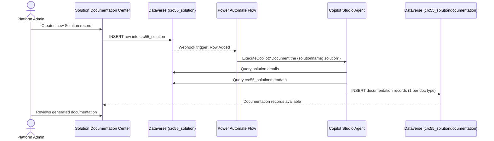
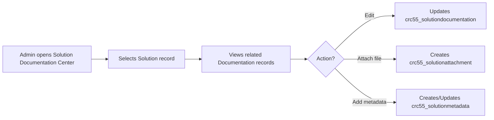

# End-to-End Process Flows

## Document Metadata

| Field | Value |
|---|---|
| **Solution Name** | Solution Documentaion |
| **Document Type** | End-to-End Process Flows |
| **Document Version** | 1.0 |
| **Generated On** | 2026-04-08 |

---

## Primary Flow: Automated Documentation Generation

### Trigger
A new row is inserted into the `crc55_solution` Dataverse table.

### Flow Diagram

---

## Step-by-Step Description

### Step 1 – Solution Registration
- **Actor:** Platform administrator or solution owner.
- **Action:** Creates a new row in `crc55_solution` via the **Solution Documentation Center** app or direct Dataverse API.
- **Required fields:** `crc55_solutionname` (mandatory).

### Step 2 – Trigger Activation
- **Component:** Power Automate Flow (`When a Solution row is added`).
- **Mechanism:** Dataverse webhook (`SubscribeWebhookTrigger`) on table `crc55_solution`, message type `1` (Create), Organization scope.
- **Execution mode:** Background (asynchronous).
- **Run as:** Calling User.

### Step 3 – Agent Invocation
- **Component:** Power Automate Flow action `Sends_a_prompt_to_the_specified_copilot_for_processing`.
- **Connector:** Microsoft Copilot Studio (`shared_microsoftcopilotstudio`).
- **Operation:** `ExecuteCopilot`.
- **Target agent:** `jenssch_solutiondocumentationagent`.
- **Message:** `"Document the {triggerOutputs()?['body/crc55_solutionname']} solution"`.

### Step 4 – Documentation Generation
- **Component:** Solution Documentation Agent (Copilot Studio).
- **Process:**
  - Agent receives the solution name in the prompt.
  - Agent retrieves solution and metadata from Dataverse.
  - Agent generates structured documentation for each required document type.
  - Each document is persisted as a row in `crc55_solutiondocumentation` with a link back to the parent `crc55_solution` record.

### Step 5 – Documentation Review
- **Actor:** Platform administrator or solution owner.
- **Action:** Opens **Solution Documentation Center** app and reviews/edits the generated documentation.
- **Available actions:** Update content, change version, deactivate stale documents.

---

## Secondary Flow: Manual Documentation Access

---

## Error / Exception Paths

| Scenario | Expected Behavior | Notes |
|---|---|---|
| Flow connection reference not configured | Flow fails to trigger or execute | Connection reference must be bound before solution is active |
| Agent not published | `ExecuteCopilot` call fails | Agent must be in active/published state |
| Dataverse permissions missing | Agent cannot read/write tables | Service principal or user account must have appropriate table-level permissions |
| Duplicate solution name | No de-duplication logic observed | Multiple documentation sets may be created for similar solution names |
